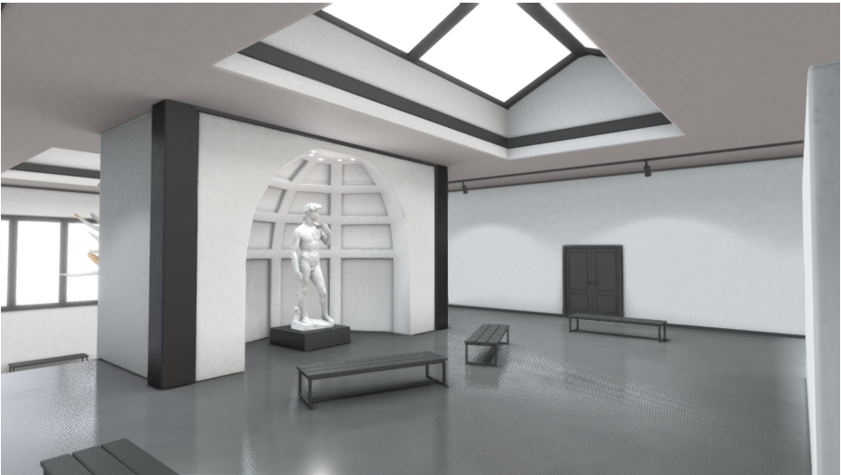
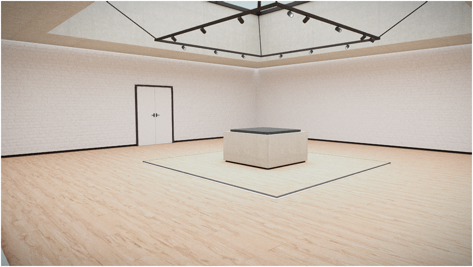
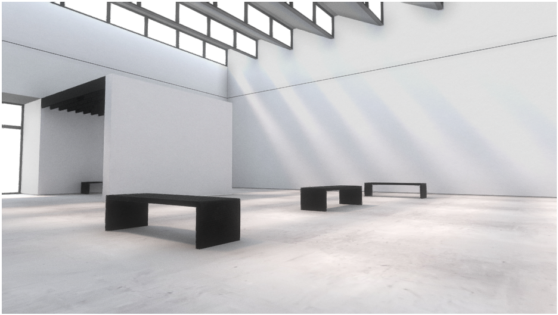
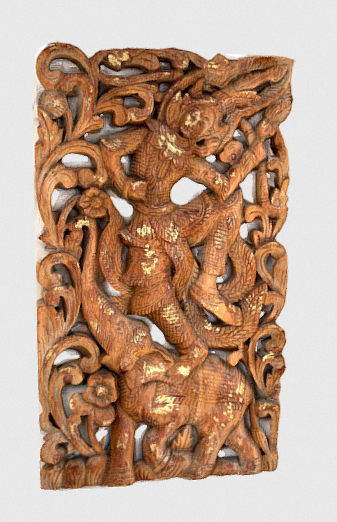
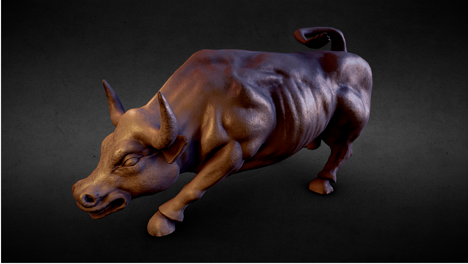
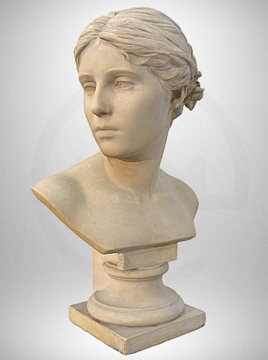
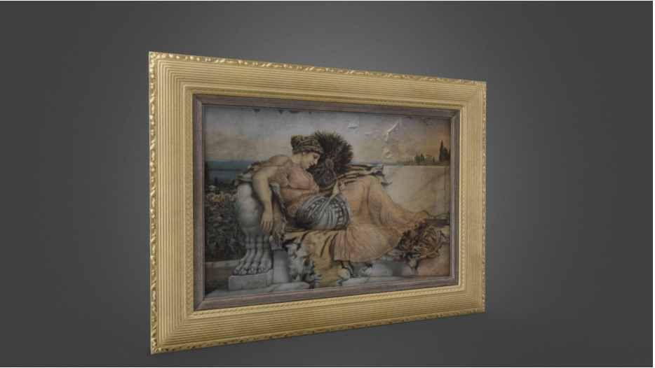
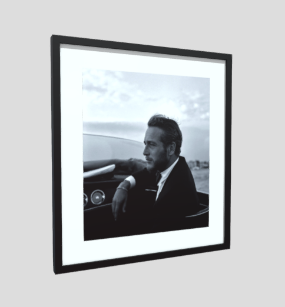

# Atividade Unidade II - Técnicas de Renderização

## Objetivos:

1. Reforçar os conceitos relacionados às técnicas de renderização fotorealistas apresentadas durante a unidade II do curso;
2. Aprofundar o entendimento de como luz e sombra podem ser controladas para aumentar o realismo dos objetos em uma cenário fotorealístico.

# A Atividade:

O objetivo dessa atividade é compor um cenário fotorealistico baseado na junção de objetos gerados a partir condições distintas de iluminação e tentar integra-los de forma harmonioza e visualmente coerente. 

Para tanto vamos simular o ambiente de uma galeria de arte, com a exposição de peças em seu interior. 

Procure no site *Sketchfab* [3], ou outro de sua preferência, modelos de: 

- Um espaço similar a uma galeria de arte ou um salão de um museu, como os apresentados na Figura 1;

   

*Figura 1 - Exemplos de ambientes de galerias de arte virtuais.*

- Esculturas, que tenham materiais com características visualmente distintas (como madeira, metal, pedra, acrilico, etc.), como mostra a Figura 2;

   

*Figura 2 - Exemplos de esculturas com diferentes materiais*

- Quadros representando pinturas ou fotografias, semelhantes aos da Figura 3.

  

*Figura 3 - Exemplos de quadros de pintura e com fotogorafia.*

De posse desses modelos crie um cenário integrado [6] [7] que possua:

1. Um ambiente onde seja possível se movimentar/caminhar; (valor 1,5 pontos)
2. Pelo menos 3 esculturas de materiais diferentes localizadas dentro do ambiente; (valor 3,0 pontos)
3. Pelo menos 2 quadros também integrados ao ambiente; (valor 2,0 pontos)
4. Como em uma galeria real, cada componente do cenário deve ter uma iluminação [4] que o destaque; (valor 2,0 pontos)
5. As esculturas devem gerar sombra [5] no ambiente. (valor 1,5 pontos)

# Entrega:

O trabalho deve ser submetido, via *Github Classroom* apenas, até a última aula do semestre, ou seja, **dia 04/09**. 

Diferentemente dos demais trabalhos do semestre essa data será um prazo definitido, não cabendo submissões após a data final. Por isso fique esperto!

## Referências:

[1] MARSCHNER, Steve; SHIRLEY, Peter. "**Fundamentals of Computer Graphics**". 5th Edition CRC Press, 2021.

[2] Dirksen, J., **Learn Three.JS: Program 3D animations and visualizations for the web with JavaScript and WebGL**. 4th Edition, Packt Publishing, 2023.

[3] **Sketchfab**, https://sketchfab.com 

[4] **Lights**, https://threejs.org/manual/#en/lights

[5] **Shadows**, https://threejs.org/manual/#en/backgrounds

[6] **Loading a .GLTF File**, https://threejs.org/manual/#en/load-gltf

[7] **Loading a .OBJ File**, https://threejs.org/manual/#en/load-obj
